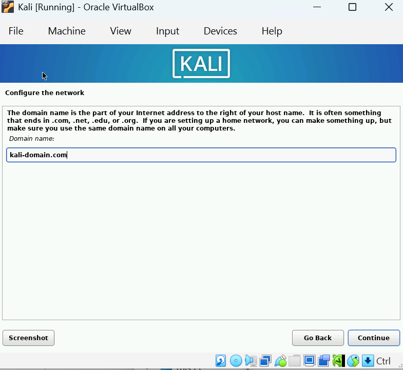
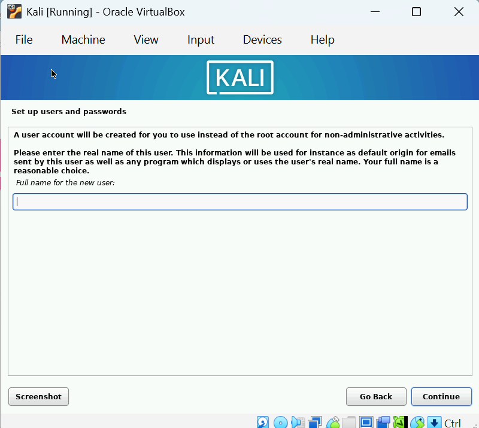
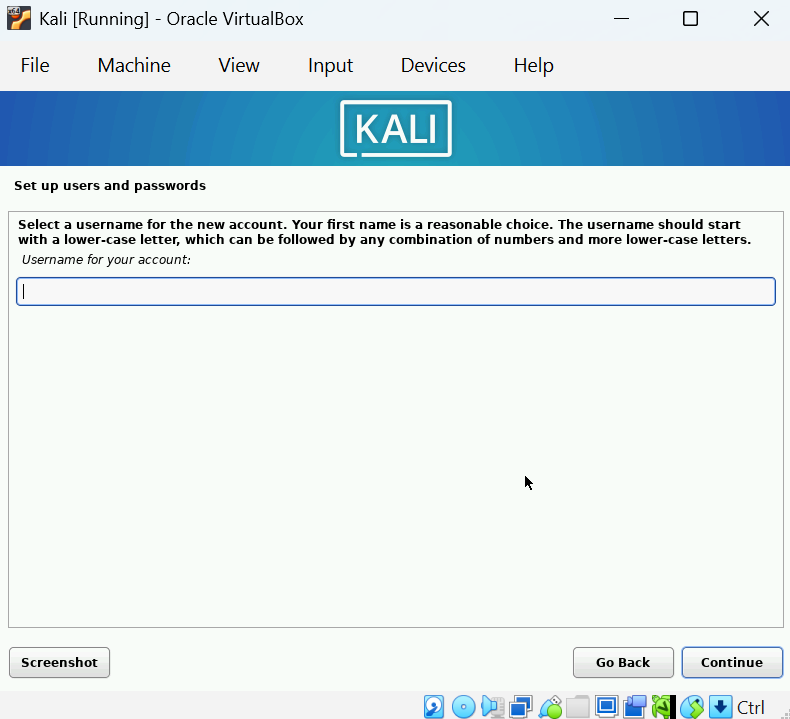
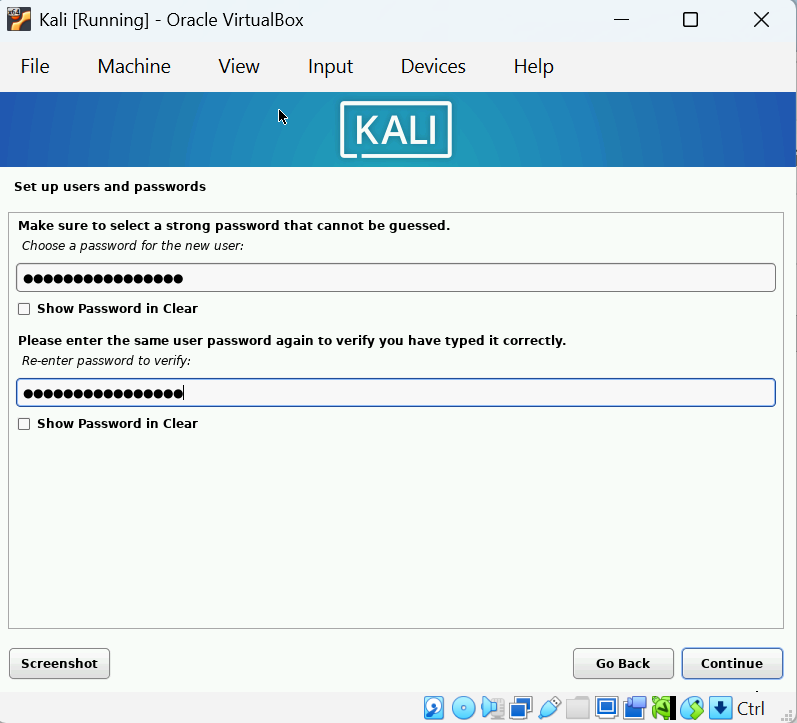
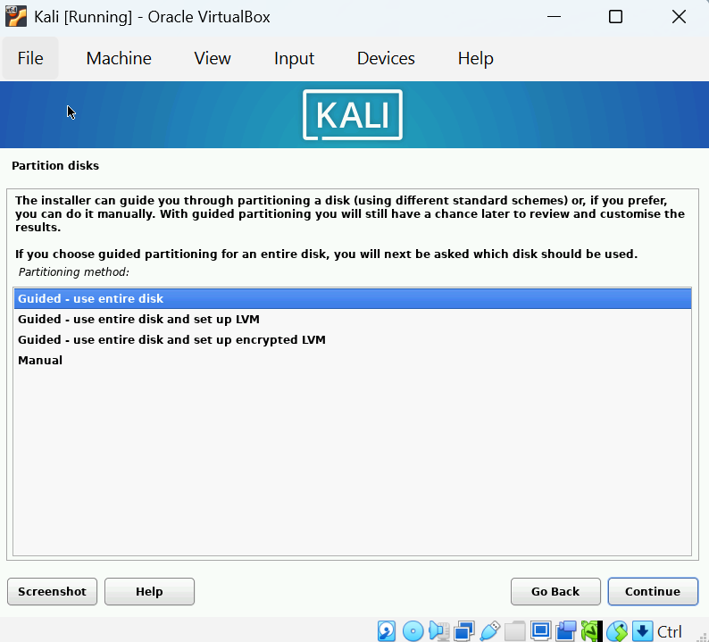
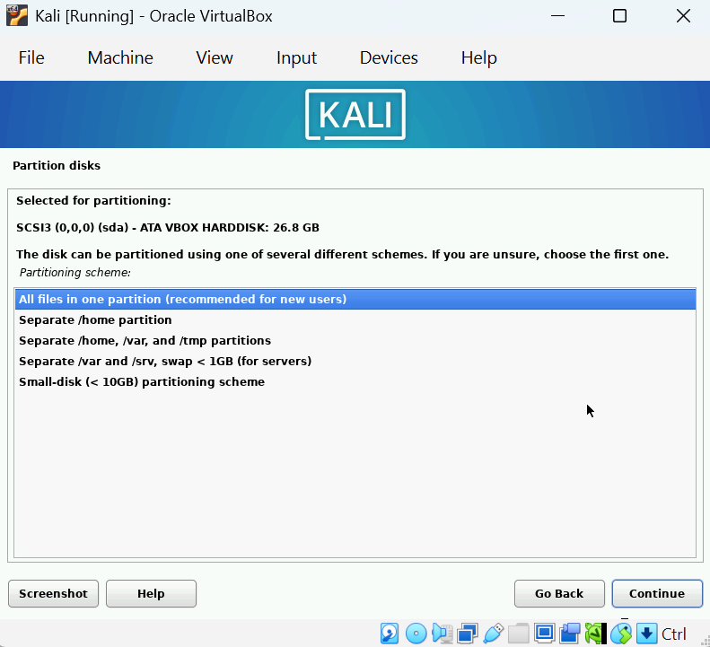
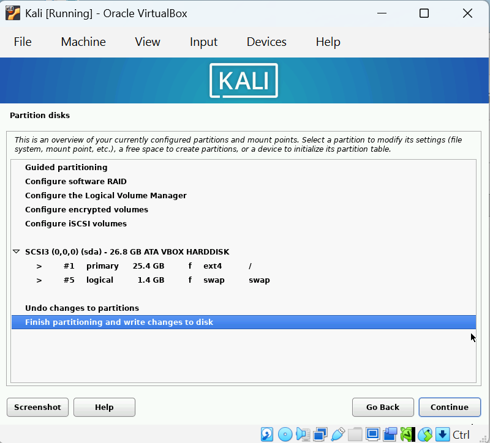
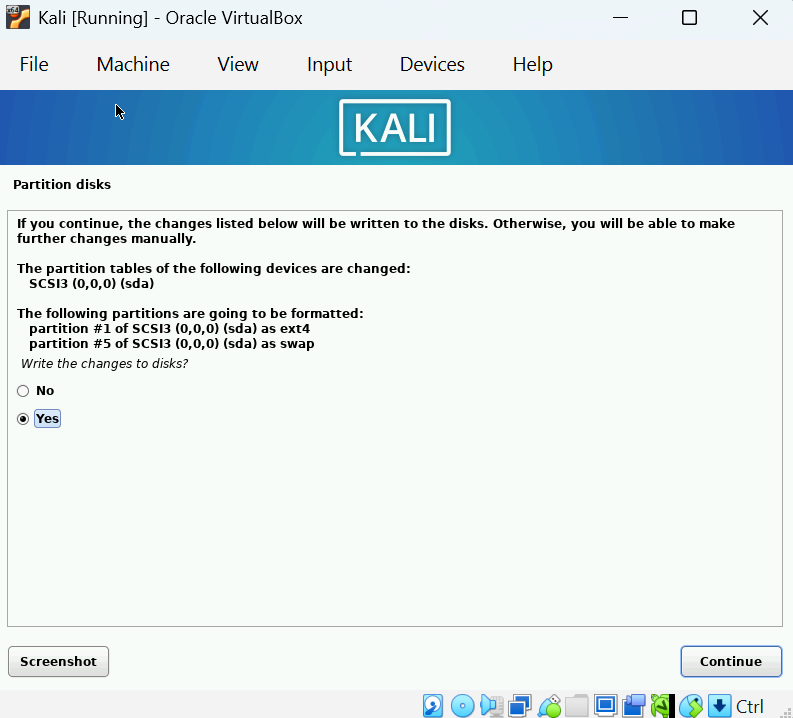
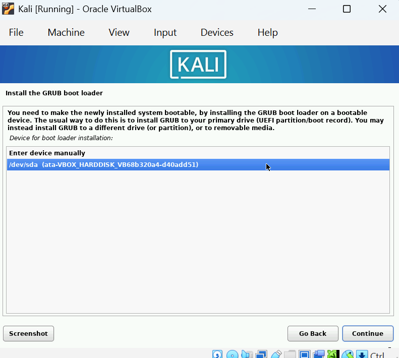
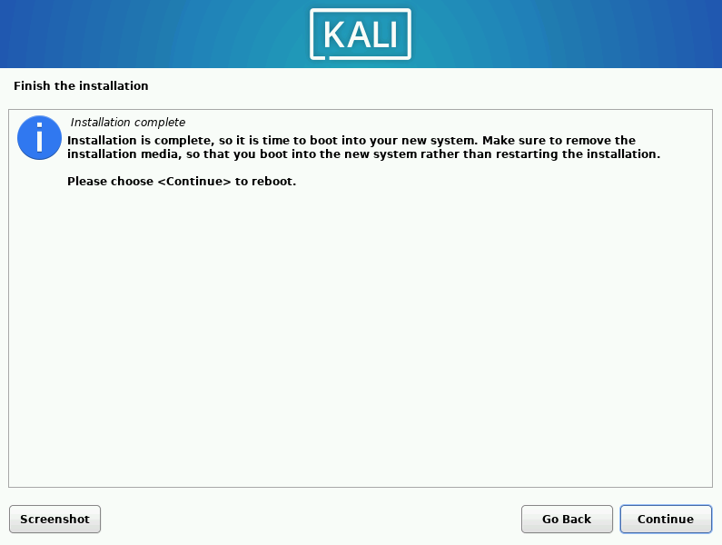

<strong>VIRTUALBOX AND KALI LINUX</strong>

**Brief Intro**

I have been interested in learning about VMs and vulnerable machines. While learning more about relevant concepts and skills, I hope to document my learning to both track my progress and reference in the future. This should be the start to a short series in exploring and getting comfortable with VirtualBox and my first vulnerable machine.  
<br><br>

-------
**Tools/Sites**

[VirtualBox][vb-site]

[Kali Linux][kali-site]

[Vulnhub][vh-site]

[Metasploitable 2][meta-site]
<br><br>

[vb-site]: https://www.virtualbox.org/
[kali-site]: https://www.kali.org/get-kali/#kali-platforms
[vh-site]: https://www.vulnhub.com/lab/
[meta-site]: https://www.vulnhub.com/entry/metasploitable-2,29/

----
**VirtualBox**

_What is it?_

VirtualBox is a software used to run virtual machines. Virtualization is the process/technology that allows for the loading and use of multiple operating systems (or virtual environments) on a singular host OS (which runs on top of a single host machine). Virtual machines are created using virtualization. These machines are isolated from the host machine and have their own resources, such as storage, memory, network, and OS. These resources, although independent, are taken and allocated from the host machine's hardware. 
Virtual machines are ideal for testing and managing vulnerable machines as they are isolated from the host machine, and can be used as sandbox environments. This allows any sort of malware or risky activity to be contained within a virtual machine, thus protecting the host machine.
<br><br>

_How to Install:_

I had downloaded VirtualBox through the official site linked above. From what I remember I had no issues with getting the software installed and running.
<br><br>

_Setting Up My First VM:_

This should be explained [below](#vm-setup) where I install Kali Linux
<br><br>

_Lessons Learned / Further Research Needed:_

I had trouble with mouse+keyboard capture. This feature allows for the VM to recognize keyboard and mouse activity and take control of the activity so that the VM can use them independent of the host. During this capture, activity is not recognized by the host. The Host key can be used to release this ownership and give control back to the host machine. Originally, the `Host key` is the right ctrl by default. As I don't have a right ctrl on my keyboard, I had to change the settings for this so that I could seamlessly switch control of my mouse + keyboard between the host and the guest machines.  
1. Open `preferences` on VirtualBox:  
  
2. Go to `Virtual Machine` in `Input` settings and change the `Host key` to `Ctrl` (or whatever key you wish you make the Host key)  
  
Further explained in the [VirtualBox Manual][vb-manual]

- I am still not too familiar with configuring VM settings, such as RAM and disk space. I hope to have a better understanding of these settings and what to choose depending on what I hope to accomplish with the VM in the future.
- I will look into creating snapshots.
<br><br>

[vb-manual]: https://www.virtualbox.org/manual/topics/working-with-vms.html#keyb_mouse_normal


----
<a name="vm-setup">**Kali Linux**</a>

_What is it?_

placeholder
- importance + usage
<br><br>

_How to Install:_

I followed [this][kali-tutorial] tutorial for installing Kali Linux onto a VirtualBox VM. The following process I took pretty much reflects the steps described on the site. 

> VirtualBox Setup + Config Process

1. Downloaded Kali Linux ISO Image


2. Created + Setup VirtualBox VM Instance for Kali Linux


3. Start VM ****


> Kali Linux Install Process

1. Graphical Install


2. Configs








3. Hard DIsk Partitions






4. Installation Customization


5. Finalization





[kali-tutorial]: https://phoenixnap.com/kb/how-to-install-kali-linux-on-virtualbox
<br><br>

_Kali Linux Setup in VirtualBox:_

placeholder
settings + reasoning
<br><br>

_Lessons Learned / Further Research Needed:_

iso files
bidirectional
<br><br>


----
**METASPLOITABLE 2**

_What is it?_

Metasploitable: 2 is a popular beginner vulnerable machine used for testing. I downloaded the VM through Vulnhub, a website that provides a collection of pre-built vulnerable VMs. These can be downloaded and used to practice hands-on security activity in a safe, sandboxed environment.
<br><br>

_How to Install:_

I downloaded Metasploitable 2 through the Vulnhub website's mirror download for the machine.  

Before installing, I checked the downloaded file's hash values to ensure its integrity:

[Here][meta-site] you should find the hash values for both MD5 and SHA1 under `File Information`  


Open PowerShell and use the following command to get the MD5 hash value  
> Get-FileHash "download-path" -Algorithm MD5  
  

> Next do the same for the SHA1 hash value  
  

I ended up using the mirror download as the hash values did not match for the original zip file download.
<br><br>

_Setting Up in VirtualBox:_

yada yada yada
settings + reasoning
<br><br>

----


<!-- > creates blockquote -->

<!-- ## Kali Linux setup {#vm-setup} -->

<!-- ins key to get in and out of overwrite mode -->

<!-- This should be explained <a href=#vm-setup>below</a> where I install Kali Linux
<span id="vm-setup">Kali Linux setup</span>
used for HTML
not for markdown -->

<!-- ----------------------------
A notice displays information that explains nearby content. Often used to call attention to a particular detail.

When using Kramdown `{: .notice}` can be added after a sentence to assign the `.notice` to the `<p></p>` element. 

**Changes in Service:** We just updated our [privacy policy](#) here to better service our customers. We recommend reviewing the changes.
{: .notice}


You'll find this post in your `_posts` directory. Go ahead and edit it and re-build the site to see your changes. You can rebuild the site in many different ways, but the most common way is to run `jekyll serve`, which launches a web server and auto-regenerates your site when a file is updated.

To add new posts, simply add a file in the `_posts` directory that follows the convention `YYYY-MM-DD-name-of-post.ext` and includes the necessary front matter. Take a look at the source for this post to get an idea about how it works.

Jekyll also offers powerful support for code snippets:

```ruby
def print_hi(name)
  puts "Hi, #{name}"
end
print_hi('Tom')
#=> prints 'Hi, Tom' to STDOUT.
``` -->